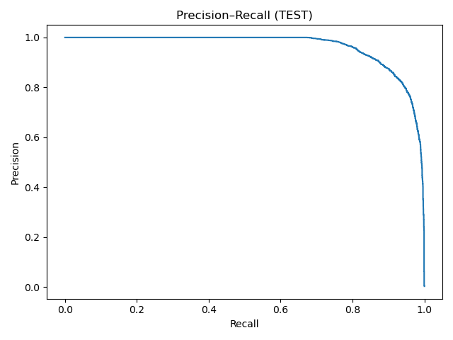
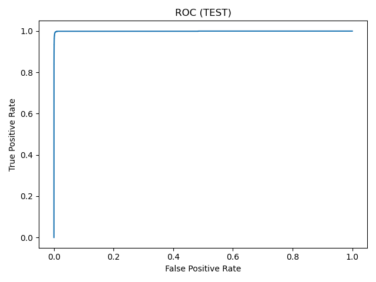
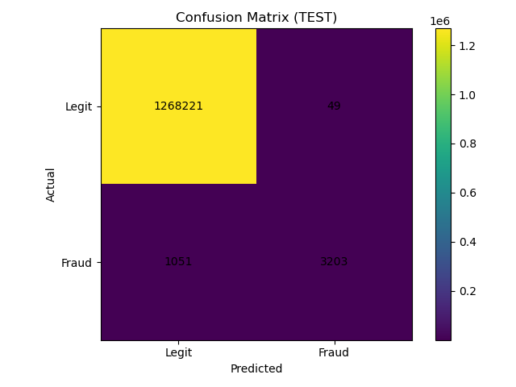

# Fraud Detection (PaySim) — LightGBM

End-to-end fraud detection on the **PaySim** dataset (~6.3M transactions).
Focus: **extreme class imbalance**, **time-aware split**, **business-oriented thresholding**, and **high-precision triage**.

##  Results

**Validation**
- PR-AUC: **0.8553**
- ROC-AUC: **0.999776**

**Test**
- PR-AUC: **0.9637**
- ROC-AUC: **0.999480**
- Threshold (from val, P≥90%): **0.9652**
- Precision (at threshold): **0.9849**
- Recall (at threshold): **0.7529**
- Precision@Top 0.5%: **0.6542**

**Confusion Matrix (Test at threshold)**
`[[TN, FP], [FN, TP]] = [[1268221, 49], [1051, 3203]]`

 




##  Data
**PaySim** simulated financial transactions with labels:
- Features used: `step, type, amount, oldbalanceOrg, newbalanceOrg, oldbalanceDest, newbalanceDest`
- Dropped IDs: `nameOrig, nameDest`; Dropped `isFlaggedFraud`
- Target: `isFraud`

##  Methodology
- **Time-aware split**: 70% Train → 10% Val → 20% Test (ordered by `step`)
- **Model**: LightGBM (`class_weight='balanced'`) with early stopping
- **Metrics**: PR-AUC primary; ROC-AUC secondary
- **Thresholding**: choose threshold on **Val** to meet **Precision ≥ 90%**, then evaluate on **Test**
- **Artifacts**: PR/ROC curves, confusion matrix, feature importance, saved model

## How to run
1) Install deps
```bash
pip install pandas numpy scikit-learn lightgbm imbalanced-learn xgboost matplotlib joblib
```
2) Open the notebook and set the path to your PaySim CSV.
3) Run cells top → bottom. Artifacts & metrics save to `artifacts/`.

##  Notes & Limitations
- PaySim is simulated; production performance depends on real data distributions.
- IDs were dropped to avoid overfitting and privacy leakage.
- Always tune thresholds to **business costs** (review cost vs missed-fraud loss).

_Last updated: 2025-09-15_
